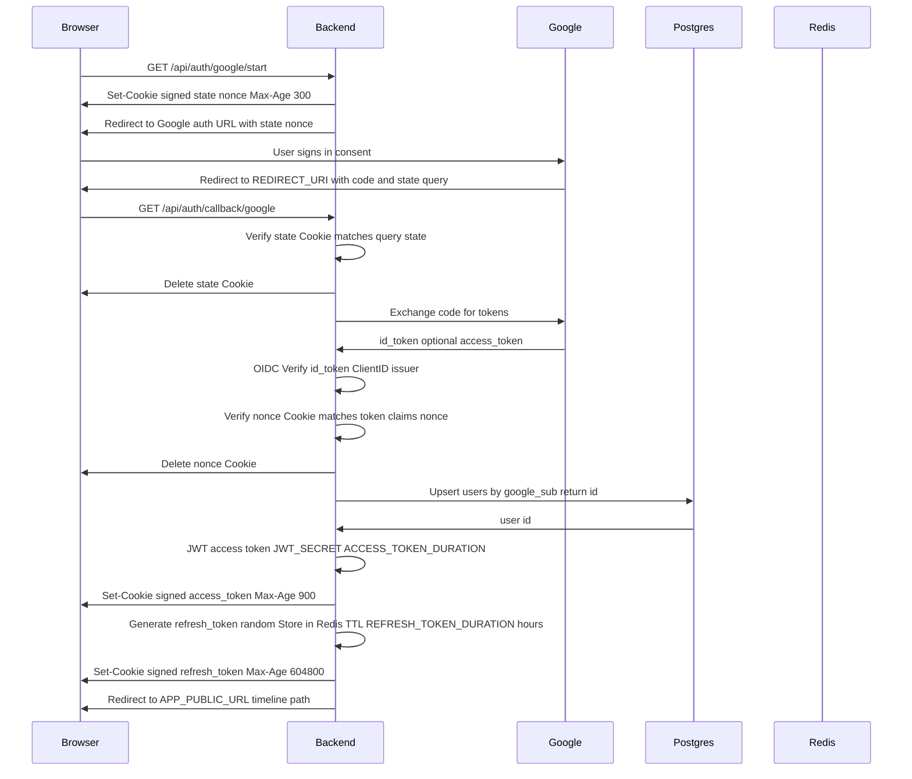
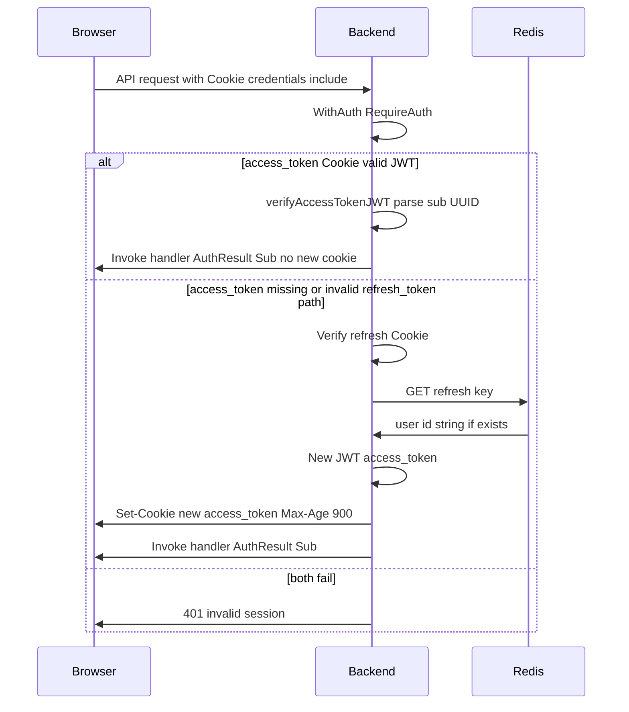
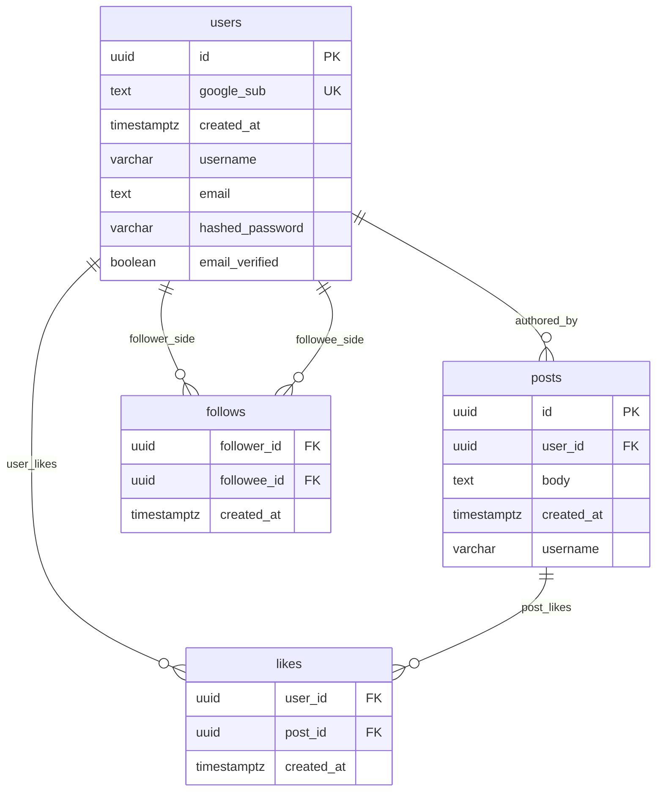

# Kaima

## 概要
Google アカウントでのログイン、投稿・いいね・フォロー、複数種類のタイムライン閲覧ができる SNS 風の Web アプリを作成しました。

このプロジェクトは新規性のある内容は含まれておらず、認証周りや基本的なアプリケーション作成に対する理解を深める・示すことを目的としています。

とりわけGoogle Oauthを利用した安全な認証フローや、認証ミドルウェアの実装に力を入れた。

---

## 機能

| 機能 | メソッド | パス |
|------|----------|------|
| Google ログイン開始 | GET | `/api/auth/google/start` |
| Google OAuth コールバック | GET | `/api/auth/callback/google` |
| Access Token Refresh | POST | `/api/auth/refresh` |
| ログアウト | POST | `/api/auth/logout` |
| 自分の情報取得 | GET | `/api/user/me` |
| ユーザー名更新 | PATCH | `/api/user/me/name` |
| 自分の投稿一覧 | GET | `/api/user/me/posts` |
| 自分のタイムライン（公開のみ） | GET | `/api/user/me/posts/public` |
| 自分のタイムライン（フォロー） | GET | `/api/user/me/posts/following` |
| 投稿作成 | POST | `/api/posts` |
| 投稿削除 | DELETE | `/api/posts/{id}` |
| いいね | POST | `/api/posts/{id}/likes` |
| いいね取り消し | DELETE | `/api/posts/{id}/likes` |
| フォロー | POST | `/api/user/{id}/follow` |
| アンフォロー | DELETE | `/api/user/{id}/follow` |
| 他ユーザー情報 | GET | `/api/user/{id}` |

保護されているハンドラはすべて [`backend/cmd/app.go`](backend/cmd/app.go) の `WithAuth` でラップされている（Google Oauthに関する上二つについてのハンドラは除く）。

---

## 技術スタック

### インフラ・外部サービス

- **PostgreSQL** … ユーザー・投稿などの永続データ
- **Redis** … リフレッシュトークンの保存（[`backend/cmd/auth.go`](backend/cmd/auth.go) など）
- **Google（OAuth 2.0 / OpenID Connect）** … ユーザー認証・`id_token` の発行
- **開発時の実行環境** … Docker Compose（[`docker-compose.dev.yml`](docker-compose.dev.yml)）で PostgreSQL `18` イメージ・Redis・バックエンド・Vite を起動

### バックエンド（Go `1.25.6`、[`backend/go.mod`](backend/go.mod)）

**標準ライブラリ**

- `net/http` … HTTP サーバ・`ServeMux`

**モジュール**

| モジュール | 役割 |
|-------------|------|
| `github.com/jackc/pgx/v5` | PostgreSQL への接続・クエリ実行（`pgxpool`） |
| `github.com/redis/go-redis/v9` | Redis クライアント |
| `golang.org/x/oauth2` | Google との認可コードフロー（`oauth2.Config` 等） |
| `github.com/coreos/go-oidc/v3` | OIDC プロバイダ・`IDTokenVerifier` による ID Token の検証 |
| `github.com/golang-jwt/jwt/v5` | アクセス JWT の発行・パース |

### フロントエンド（[`frontend/package.json`](frontend/package.json)）

**ビルド・言語ツール**

- **Vite** `8`、`TypeScript` `6.x`（開発サーバ・型付け）

**依存ライブラリ（npm）**

- **React** `19`、`react-dom` … UI
- **react-router-dom** `7` … ルーティング

---

## アーキテクチャ

- **開発時**：フロントの Vite は [`frontend/vite.config.ts`](frontend/vite.config.ts) において、 `/api/` をバックエンド（compose 内ホスト名 `backend:8080`）へプロキシする。`/api/**` で API を叩く設計となり、ブラウザからは同一オリジンとして認識される。
- **本番**：環境変数 `WEB_DIST_DIR` に有効なディレクトリが指定されていれば、[`main.go`](backend/cmd/main.go) が [`SpaHandler`](backend/cmd/static.go) により SPA を `GET /{path...}` で配信する。
- **フロントの API 呼び出し**：[frontend/apis/API.ts](frontend/apis/API.ts) において、 `credentials: "include"` により Cookie とともにリクエストを送信する。

---

## 認証フロー

<!-- 以下はコード上の順序・手段の説明であり、設計理由や脅威モデルは後段の自分用セクションへ委ねます。 -->

1. **`GET /api/auth/google/start`**（[`handlers_auth.go`](backend/cmd/handlers_auth.go)）

   ランダムな `state` と `nonce` を生成する。

   両方を署名付き Cookie（[`MakeSignedCookie`](backend/cmd/cookie.go)）としてセットする。

   そのうえで `AuthCodeURL` に `state`・`nonce`・環境変数 `REDIRECT_URI` を載せ、[Google の認証画面へ HTTP 302 リダイレクト](backend/cmd/handlers_auth.go)する。

2. **`GET /api/auth/callback/google`**

   まず Cookie の `state` を検証する。

   その後認可コードを `Exchange` し、得られた OpenID Token を OIDC verifier で検証する。

   さらに Cookie と ID Token claims の `nonce` を検証する。

   そして OpenID Token のフィールドである `sub` で `users` を upsert し、内部ユーザー ID を得る。

3. **セッション用 Cookie**

   - `access_token`：内部ユーザー ID を `sub` にした JWT（署名鍵、有効時間設定済）。

      値は署名付き Cookie。Cookie の **`Max-Age` はログイン／リフレッシュ時とも 900 秒で固定**。

   - `refresh_token`：ランダムな文字列を Redis に `SET`（TTL設定済）。

      同名の署名付き Cookie の `Max-Age` はコード上 `604800` 秒。

4. **ログイン完了後**：`${current_host}/timeline` へリダイレクト。

5. **`WithAuth()`**

   認証ミドルウェアとなる関数。`access_token` Cookie の存在・正当性を検証する。

6. **`POST /api/auth/refresh`**

    Access Token の再発行用のEndpoint. Access Tokenが存在しない場合にフロントエンドから呼ばれる。Refresh Tokenが有効ならAccess Tokenが再発行させる。

7. **ログアウト**：`access_token` / `refresh_token` Cookie を削除し、Redis のリフレッシュキーを `DEL`。

8. **Cookie の共通属性**：`HttpOnly: true`、`SameSite: Lax`、`Secure` はデプロイ時 `true`。値は名前と値から HMAC（`HMAC_SECRET_KEY`）した署名付き。

9. **OAuth のスコープ**：`openid` のみ。

### 認証・Cookie・セッションについて（設計判断・自分用メモ）

- state：「そのRedirectURIは本当に自分起点で作り出されたものか？」

    CookieとRedirectURIのパラメータとして存在する。攻撃者が用意したRedirectURIを被害者に踏ませることで、被害者が攻撃者のリソースに間違って侵入し、個人情報などを入力してしまうCSRFを防いでいる。

    具体的には、被害者のstate CookieがRedirectURI中のstateと一致することがないため防ぐことができている。

    stateはRequestURIに入ってはいるものの、HTTPSによって通信は保護されているので盗み見られることはない。

- nonce：「その認可コードは本当に最新の自分のためのものか？」

    Google Authorization ServerにURIパラメータとしてnonceを送った上で、そのnonceが含まれたOpenID(JWT)が返ってくる。このnonceを事前にセットしたnonce Cookieと一致するかどうかで、そのOpenIDが本当に自分のものであるかどうかを判定できる。

    つまり、攻撃者が被害者のOpenIDを盗み取り、それを使ってログインしようとするReplay Attackを防いでいる。被害者のOpenIDに含まれるnonceと、攻撃者が持っているnonce Cookieが一致することがないからだ。

    また、nonceは一度しか使われないため、過去の自らのOpenIDトークンを利用してしまうことも防いでいる。

- SameSite=Lax: 異なるオリジンのサイトからのリクエストには、トップレベルナビゲーションでない限りCookieを付けない。

    例えばある掲示板に `` という悪質なタグがあったとする。

    するとブラウザは画像読み込みのためにこのsrcをGETする。その際、ブラウザは勝手に `bank.com` のCookieをセットして送信してしまう。

    それを防ぐのがSameSiteで、SameSite=Strictにしておけば異なるオリジンからのCookieをブラウザがセットすることはなくなる。

    ただそうすると、例えばGoogleからXに飛ぶ時に、Cookieがないせいで毎回ログインするハメになるため、SameSite=Laxとすることで、トップレベルでの移動ではCookieをつけるのが現在の標準である。

- HttpOnly: JavaScriptからはCookieの中身が見えないようにする。

    前述したSameSiteは、同オリジンの中に悪意のあるスクリプトが存在する場合は対処できないという弱点を持つ。

    それを半分解決するのがHttpOnlyで、例え同オリジンであっても、JSはそのCookieの中身を見ることができない。

    それによってCookieの悪意あるプログラムへの流用を防いでいる。

    ただし中身が見えなくてもCookieを利用するだけのスクリプトに対しては、CORS/CSPなどの対策が必要である。

- Refresh Token: Access Token の再発行に使用。

    たとえ盗まれても被害を最小限に抑えるため、Access Tokenの有効期間は短くしてある。

    しかしその度にログインを要求してはUXが損なわれるため、Refresh Tokenを利用して自動でAccess Tokenを再発行する必要がある。

    Access Tokenが不正だった際、サーバーはユーザーのRefresh Tokenを確認し、それをkeyとしてRedisからUserIDを取得する。

    それを元にAccess Tokenを再発行することで、ユーザーは引き続きサービスを利用することができる。

    DBではなくRedisを利用しているのは、{Refresh Token: userID} の関係は永続ではなく一時的であるからである。

    ただし現在の実装ではRefresh Token Cookieは毎リクエストに含まれており、Access Tokenと盗まれる経路が同等になってしまっているため、Refresh Token用のAPIを用意するなどして必要な時のみ呼ぶ必要がある。


- Access Token再発行について。

    上記の問題を解決するために、Refresh Token用のAPIを用意した。 パスは`POST /api/auth/refresh`。

    これで普段のリクエストにはRefresh Tokenが含まれることはなくなる。

    **Refresh Token の発行タイミング**：OAuth callback（`GET /api/auth/callback/google`）でのみ行う。`POST /api/auth/refresh` は **Refresh Token → Access Token の再発行だけ**を担当し、Access Token から Refresh Token を新規発行してはならない。

    Access Token だけ valid な状態で Refresh Token を発行できるようにすると、短期トークンの漏洩が長期セッション（Redis TTL 168h）への **権限昇格** になる。Refresh Token は OAuth で本人確認が済んだときだけ発行するのが正しい。

    **Path 属性**：Set-Cookie の `Path` はレスポンス URL ではなく属性で決まるため、callback から `Path=/api/auth/refresh` を付けて Set-Cookie することは可能である。現状は `Path=/api/auth` だが、狭い Path に変更すると logout 等では Cookie がリクエストに付かないため、Redis 側の失効処理は access_token から userId を特定するなど別途設計が必要になる。

    

<!-- 追記例: state を入れた狙い／nonce と ID Token の組み合わせの狙い／HttpOnly と SameSite のトレードオフ／なぜ Redis に refresh を載せているか／OIDC verifier に ClientID を渡している意味／JWT と Cookie Max-Age の関係について -->

---

## シーケンス図

### Google ログイン〜セッション Cookie まで



### 認証済み API リクエスト



---

## ER 図

マイグレーションは [`backend/database/migrations/`](backend/database/migrations/) を参照。



**注記**

- `users.google_sub`：NULL 許容（migration `000008`）。Google OAuth ユーザー向け。`UNIQUE` 制約は列定義のまま。
- `users.username`：NULL 許容。`(username IS NOT NULL AND username <> '')` の行にのみ効く一意制約インデックス `users_username_unique`（migration `000007`）。ER 図では部分的 UNIQUE を表現しきれないため上記のみ記載する。
- `users.email`：NULL 許容。メール／パスワード登録および OAuth 連携時の重複検知用。`(LOWER(email) WHERE email IS NOT NULL AND email <> '')` に効く一意制約インデックス `users_email_unique`（migration `000008`）。
- `users.hashed_password`：NULL 許容。平文パスワードは保存しない。
- `users.email_verified`：`NOT NULL DEFAULT FALSE`。メール確認済みかどうか。
- `posts.username`：投稿時に表示用として保持する列（migration `000006`）。
- `likes`：`PRIMARY KEY (user_id, post_id)` により、同一ユーザーが同一投稿に複数の like を挿入できない。
- `follows`：`follower_id` と `followee_id` はいずれも `users.id` を参照。主キーは `(follower_id, followee_id)`。

<!-- 中立な説明のみ一行：`likes` テーブルの複合主キーにより、ユーザー×投稿単位での重複した「いいね」行はデータベース上拒否されます。 -->

### データモデル・非正規化について（設計判断・自分用メモ）

- likes table の存在意義：誰がいいねしたか把握するため。

    いいね機能の追加にあたって、likes tableの他にもう一案存在した。

    それは「posts tableのカラムとしてlikeCountを追加する」というものである。

    ただしこれは誰がいいねをしたか、また自分がいいねをしたかすら把握できなくなってしまう。

    さらに、そこからいいね機能を実装しようとすれば、postsにlikedBy カラムなどの誰がいいねをしたかを把握する列を追加することになる。

    その場合、一つのセルに複数ユーザーを詰め込んで1NF違反となるか、いいねをするたびにlikedByカラムのみが変わった行がどんどん増えて冗長となってしまう。

    したがってこの案は却下され、現在の通りlikes tableを導入することになった。

- posts.username の導入

    各postに作成者のusernameを表示するためにはDB上では二つの方法が存在する。

    一つはそのpostに紐つくuser_idを使って、users tableからusernameを引っ張ってくる方法。

    正規化は保たれるが、全てのpostに対しクエリを打つ必要があるためパフォーマンスが低下する。

    もう一つはposts tableにusernameカラムを追加する方法。

    クエリ一回でusernameを取得できるが、{user_id, username}間の関数従属性により3NFが損なわれる。

    今回はパフォーマンスと更新の煩雑さのトレードオフを考慮した結果、二つ目の方法を導入した。

    理由としては、正規化を損なうことによる追加のクエリは「postを作る際のusernameの挿入」「usernameが変更された際、posts table 内のusernameの更新」にとどまる一方で、もし正規化を保てば一つ一つのpostに対してクエリを打つ必要があるからである。

    ただし今気づいたがJOIN句を使えば正規化による問題を避けることができるので、その方向で後ほど実装し直す。
---

## 環境変数

一覧は [.env.example](.env.example)。バックエンドが参照する変数と用途：

| 変数 | 用途 |
|------|------|
| `POSTGRES_URL` | pgx の接続文字列 |
| `CLIENT_ID` / `CLIENT_SECRET` | Google OAuth クライアント |
| `REDIRECT_URI` | OAuth redirect（`oauth2.Config` と `AuthCodeURL` の両方） |
| `HMAC_SECRET_KEY` | Cookie 署名（[`SignCookie`](backend/cmd/cookie.go)） |
| `JWT_SECRET` | アクセス JWT の HMAC-SHA256 署名 |
| `ACCESS_TOKEN_DURATION` | アクセス JWT の有効時間（分） |
| `REFRESH_TOKEN_DURATION` | Redis に保存するリフレッシュの TTL（時間・数値として整数時間） |
| `APP_PUBLIC_URL` | OAuth 後リダイレクト先ベース URL |
| `COOKIE_SECURE` | `true` / `1` で `Secure` Cookie |
| `REDIS_ADDR` または（`REDIS_HOST` と `REDIS_PORT` の組み合わせ） | Redis 接続（未設定時のデフォルトは compose では `redis:6379`） |
| `REDIS_PASSWORD` | Redis 認証がある場合 |
| `PORT` | サーバ公開ポート（未設定時 `8080`） |
| `WEB_DIST_DIR` | 静的 SPA を配信するディレクトリ（任意） |

---

## ローカル開発

前提：ルートで `.env` を用意（項目は [.env.example](.env.example)）。Google Cloud Console 側で OAuth クライアントと `REDIRECT_URI` が一致していること。

```bash
docker compose -f docker-compose.dev.yml up --build
```

想定ポート（[`docker-compose.dev.yml`](docker-compose.dev.yml)）：

- フロント（Vite）: `5173`
- API: `8080`
- PostgreSQL: `5432`
- Redis: `6379`

Vite がプロキシ先に `backend` ホスト名を使っているため、**開発時は上記 compose 経由でフロントと API をまとめて起動するのがそのまま動かしやすい**。

---

## 開発ログ・振り返り

（追記予定）

---

